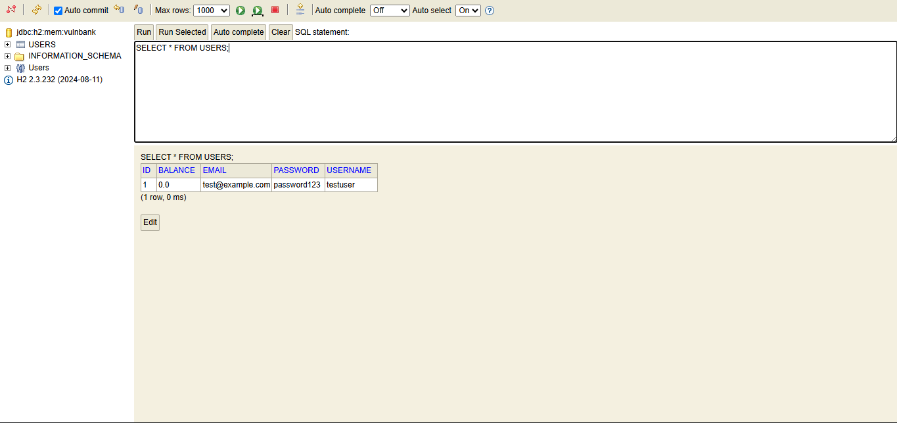
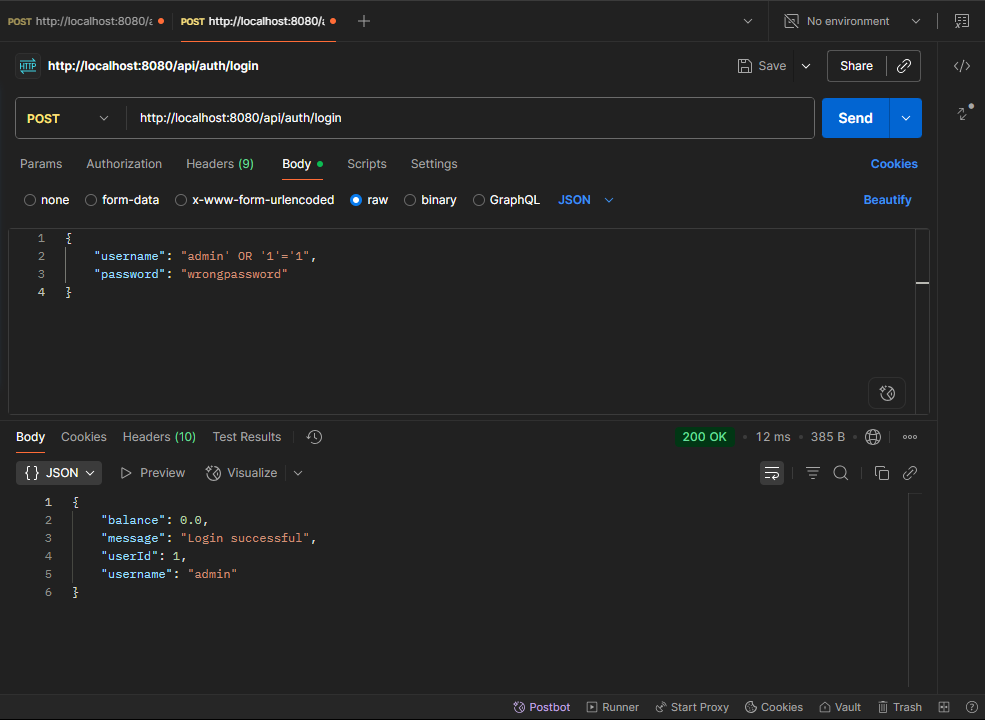

# VulnBank API - Intentionally Vulnerable Banking API

A deliberately insecure REST API built with Spring Boot to demonstrate common security vulnerabilities and their fixes.

## ⚠️ WARNING
This application contains intentional security vulnerabilities for educational purposes. **DO NOT deploy to production or use with real data.**

## 🎯 Purpose
This project demonstrates:
- Common OWASP Top 10 vulnerabilities in real code
- How to identify security flaws
- Secure coding practices and fixes
- Security testing techniques

## 🏗️ Project Structure
```
vulnbank-api/
├── src/main/java/com/vulnbank/api/
│   ├── model/          # User entity
│   ├── repository/     # Database layer
│   ├── controller/     # API endpoints
│   └── config/         # Security configuration
├── screenshots/        # Vulnerability demonstrations
└── README.md
```

## 🚀 Setup & Running
1. Clone the repository
2. Run: `./mvnw spring-boot:run`
3. API runs on `http://localhost:8080`
4. H2 Console: `http://localhost:8080/h2-console`

## 📊 Current Features
- ✅ User Registration (POST /api/auth/register)
- ✅ User Login (POST /api/auth/login) - **Vulnerable to SQL Injection** ⚠️
- 🔜 Balance Check (broken access control)
- 🔜 Money Transfer (missing authorization)

## 🐛 Vulnerabilities Implemented

### 1. A02: Cryptographic Failures ⚠️
**Status:** ✅ Implemented  
**Location:** `AuthController.register()`  
**Issue:** Passwords stored in plain text  
**Evidence:** See `screenshots/02-plaintext-password-database.png`  

**Proof:**


**Impact:** If database is compromised, all passwords are exposed  
**Fix:** (Will be implemented in secure branch)

### 2. A08: Software and Data Integrity Failures ⚠️
**Status:** ✅ Implemented  
**Location:** `AuthController.register()`  
**Issue:** No input validation, mass assignment possible  
**Test:** Send `{"username":"hacker","balance":9999999}` to registration  
**Impact:** Users can set their own balance, bypass business logic  
**Fix:** (Will be implemented in secure branch)

### 3. A03: SQL Injection ⚠️
**Status:** ✅ Implemented  
**Location:** `AuthController.login()`  
**Issue:** Login endpoint uses string concatenation to build SQL queries  
**Test:** Login with username `admin' OR '1'='1` and any password  
**Evidence:** See `screenshots/04-sql-injection-bypass.png`  

**Proof:**


**Impact:** Complete authentication bypass, access any account without password  
**Fix:** (Will be implemented in secure branch)

---

## 🔐 Vulnerabilities To Be Implemented
- [x] SQL Injection (A03) ✅
- [ ] Broken Access Control (A01)
- [ ] Authentication Failures (A07)
- [ ] Security Misconfiguration (A05)

## 🛠️ Tech Stack
- Java 17
- Spring Boot 3.5.6
- Spring Security
- Spring Data JPA
- H2 Database
- Maven

## 📚 Learning Resources
- [OWASP Top 10](https://owasp.org/www-project-top-ten/)
- [Spring Security Documentation](https://spring.io/projects/spring-security)

## 👤 Author
Yahia Amir Anwar  
[LinkedIn](https://linkedin.com/in/yahia-amir071933246) | [GitHub](https://github.com/Yahiaamirr)

## 📄 License
Educational purposes only.