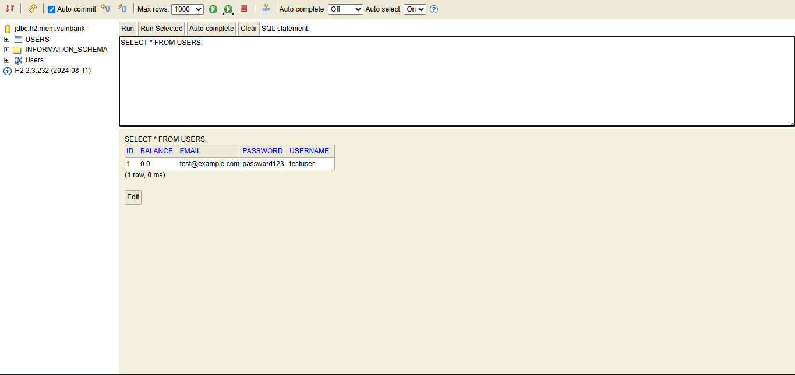

# Security Analysis - VulnBank API

⚠️ **DISCLAIMER:** This application contains intentional security vulnerabilities for educational purposes only.

## Overview
This document provides detailed technical analysis of each vulnerability implemented in VulnBank API, including:
- OWASP classification
- Vulnerable code locations
- Exploitation steps
- Impact assessment
- Remediation guidance

---

## Implemented Vulnerabilities

### VULN-001: Cryptographic Failures - Plain Text Password Storage

**OWASP Category:** A02:2021 – Cryptographic Failures  
**Severity:** 🔴 Critical  
**CWE ID:** CWE-256 (Plaintext Storage of a Password)  
**Status:** ✅ Implemented

#### Description
User passwords are stored in the database without any hashing or encryption, violating fundamental security principles.

#### Vulnerable Code
**File:** `src/main/java/com/vulnbank/api/controller/AuthController.java`  
**Lines:** 23-24
```java
// VULNERABILITY: Password stored in plain text
User savedUser = userRepository.save(user);
```

#### Proof of Concept
1. Register a new user via POST `/api/auth/register`:
```json
{
    "username": "victim",
    "email": "victim@example.com",
    "password": "MySecretPassword123"
}
```

2. Access H2 Console at `http://localhost:8080/h2-console`
3. Execute query: `SELECT * FROM USERS;`
4. Observe password stored as `MySecretPassword123` in plain text

**Evidence:**  


*Screenshot shows user 'testuser' with password 'password123' stored in plain text in the USERS table.*

#### Impact
- **Confidentiality Breach:** Database compromise exposes all user passwords
- **Account Takeover:** Attackers gain immediate access to all accounts
- **Credential Reuse:** Users often reuse passwords across services
- **Compliance Violation:** Violates GDPR, PCI-DSS, HIPAA requirements
- **Reputational Damage:** Severe trust and brand damage

#### Attack Scenario
```
1. Attacker gains database access (SQL injection, backup theft, insider threat)
2. Attacker exports USERS table
3. Attacker logs in as any user with their plain text password
4. Attacker accesses sensitive financial data and transfers funds
```

#### Remediation
**Secure Implementation:**
```java
import org.springframework.security.crypto.bcrypt.BCryptPasswordEncoder;

@Autowired
private BCryptPasswordEncoder passwordEncoder;

@PostMapping("/register")
public ResponseEntity<?> register(@RequestBody User user) {
    // Hash password before storing
    String hashedPassword = passwordEncoder.encode(user.getPassword());
    user.setPassword(hashedPassword);
    
    User savedUser = userRepository.save(user);
    // ... rest of code
}
```

**Configuration Required:**
```java
@Bean
public BCryptPasswordEncoder passwordEncoder() {
    return new BCryptPasswordEncoder();
}
```

#### References
- [OWASP Password Storage Cheat Sheet](https://cheatsheetseries.owasp.org/cheatsheets/Password_Storage_Cheat_Sheet.html)
- [CWE-256: Plaintext Storage of a Password](https://cwe.mitre.org/data/definitions/256.html)
- [Spring Security Password Encoding](https://docs.spring.io/spring-security/reference/features/authentication/password-storage.html)

---

### VULN-002: Software and Data Integrity Failures - Mass Assignment

**OWASP Category:** A08:2021 – Software and Data Integrity Failures  
**Severity:** 🟠 High  
**CWE ID:** CWE-915 (Improperly Controlled Modification of Dynamically-Determined Object Attributes)  
**Status:** ✅ Implemented

#### Description
The registration endpoint accepts raw User objects without validation, allowing attackers to set arbitrary fields including their account balance.

#### Vulnerable Code
**File:** `src/main/java/com/vulnbank/api/controller/AuthController.java`  
**Line:** 15
```java
@PostMapping("/register")
public ResponseEntity<?> register(@RequestBody User user) {
    // VULNERABILITY: Accepts all User fields without validation
    // Attacker can set balance, id, or any other field
```

#### Proof of Concept
**Normal Registration:**
```json
POST /api/auth/register
{
    "username": "normaluser",
    "email": "normal@example.com",
    "password": "password123"
}
// Result: balance = 0.0
```

**Malicious Registration:**
```json
POST /api/auth/register
{
    "username": "hacker",
    "email": "hacker@example.com",
    "password": "password123",
    "balance": 9999999.99
}
// Result: balance = 9999999.99 (attacker sets own balance!)
```

#### Impact
- **Financial Loss:** Users create accounts with arbitrary balances
- **Business Logic Bypass:** Circumvents all balance validation
- **Data Integrity:** Attackers modify protected fields
- **Privilege Escalation:** Could set admin flags if they existed

#### Remediation
**Use Data Transfer Objects (DTOs):**
```java
// Create RegisterRequest DTO
public class RegisterRequest {
    private String username;
    private String email;
    private String password;
    // No balance field - user cannot set it
}

@PostMapping("/register")
public ResponseEntity<?> register(@RequestBody RegisterRequest request) {
    User user = new User();
    user.setUsername(request.getUsername());
    user.setEmail(request.getEmail());
    user.setPassword(passwordEncoder.encode(request.getPassword()));
    user.setBalance(0.0); // Set by server, not client
    
    User savedUser = userRepository.save(user);
}
```

#### References
- [OWASP Mass Assignment Cheat Sheet](https://cheatsheetseries.owasp.org/cheatsheets/Mass_Assignment_Cheat_Sheet.html)
- [CWE-915](https://cwe.mitre.org/data/definitions/915.html)

---

## Vulnerabilities To Be Implemented

### 🔜 VULN-003: Injection - SQL Injection in Login
**OWASP:** A03:2021  
**Severity:** 🔴 Critical  
**Status:** ⏳ Pending

### 🔜 VULN-004: Broken Access Control
**OWASP:** A01:2021  
**Severity:** 🔴 Critical  
**Status:** ⏳ Pending

### 🔜 VULN-005: Identification and Authentication Failures
**OWASP:** A07:2021  
**Severity:** 🟠 High  
**Status:** ⏳ Pending

### 🔜 VULN-006: Security Misconfiguration
**OWASP:** A05:2021  
**Severity:** 🟠 High  
**Status:** ⏳ Pending

---

## Testing Guide

### Prerequisites
- Postman or curl installed
- Application running on `http://localhost:8080`
- H2 Console accessible at `http://localhost:8080/h2-console`

### Test Each Vulnerability
Each vulnerability section above includes:
1. Exploitation steps
2. Expected results
3. Evidence location (screenshots)

---

## Secure Branch
All vulnerabilities will be fixed in the `secure` branch with:
- Secure implementations
- Code comparisons (before/after)
- Security best practices
- Additional protective measures

---

**Last Updated:** October 15, 2025  
**Author:** Yahia Amir Anwar